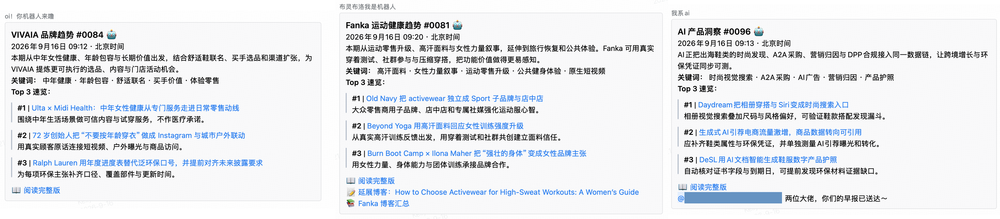
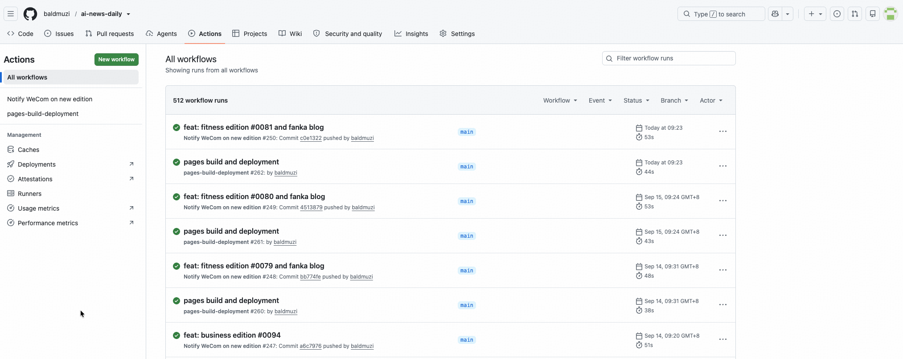

## 实现成果

- 线上日报中心：[AI 自动化日报中心](https://baldmuzi.github.io/ai-news-daily/)
- 工作日早上定时在企业微信机器人发布相关日报：



使用工具：
- 自动化抓取信息：codex/claude
- 项目地址：[ai-news-daily](https://github.com/baldmuzi/ai-news-daily)
- 部署：GitHub Pages
- 推送企微webhook机器人：GitHub Actions

## 需求背景及实现方式
企业开始运用并寻找AI接入工作流的可能性，每个人都在探索使用ai进行增效的方法。作为开发，对于ai有着更好的基础，基于此，为了帮助品牌运营消除信息差，提升市场敏锐度，辅助开发以及产品经理关注行业最新动态，按照技术、跨境电商、运动健康、社媒洞察、鞋服品牌趋势拆分频道，分别制定了日报推送机器人。

前期工作：先定义每个频道的读者、来源白名单、时效窗口、选题约束、输出格式和品牌视角。例如 Fanka 社交日报要求近 72 小时趋势、近 7 天账号拆解、近 30 天痛点，并明确禁止重复、编造热度或把无法验证的线索写成事实；

内容生产如何实现：每个远程 AI 任务独立搜索、筛选 Top 10、写中文点评，并生成三类文件：
- 频道/edition-XXXX.html：当期完整日报；
- 频道/index.html：最多展示最近 20 期的存档；
- latest-频道.json：企业微信推送所需的精简数据。

为什么要用 JSON：完整网页适合阅读，JSON 适合分发。edition、日期、导语、标签、Top 3、页面地址构成稳定内容契约。

自动通知如何实现：GitHub Actions 只在相关频道文件变更时运行。脚本会：
- 根据本次 push 的准确 diff 判断哪些频道需要通知；
- 轮询 GitHub Pages，最多等待 8 分钟，避免“消息先到、页面未上线”；
- 生成企业微信 Markdown；
- 最多重试 3 次发送；
- 支持频道独立 Webhook、多人 @ 提醒和 Fanka 社交频道的回退配置。

关键设计取舍：频道目录互相隔离，避免多个 AI 任务改同一文件；根目录门户页保持人工维护；静态文件天然可审计、可回滚、成本低；而定时调度并不在仓库内，它依赖外部的 Claude Code 远程任务或调度器。

## 项目流程卡点及解决方案
--初期使用Claude作为自动化工具，发现配置为自动化后，因为Claude将自动化配置在远程中，而沙盒环境白名单不包含企微，因此无法推送webhook
-- 解决方案为创建项目，将日报内容放置在github中转一圈：
Claude -> github -> 通过action -> webhook
即把html文件push到远程github仓库
然后通过github的 actions 触发一个工作流，往企微推消息
这样 Git 就成了内容版本库，HTML 直接由 GitHub Pages 承载，不需要数据库、CMS 或服务器。



--许多次部署成功但是企微并没有推送日报，经过排查发现是因为Pages 发布有延迟，因此必须保留 HTTP 200 轮询和 webhook 重试。

## 注意事项：
防止AI幻觉；事实核验优先于凑数。尤其社媒内容要区分“趋势”“观察线索”和“无法验证”，不能把搜索摘要当事实。
安全性：密钥不能写进提示词或 Git。
内容新鲜度要监控：需要硬性规定查重，三天内日报不能出现同一篇报道

## 提示词参考：
以VIVAIA的品牌运营日报为例：

~~~~text
你是 VIVAIA 品牌的商业趋势编辑。
VIVAIA 是一家中国出海全球的女鞋品牌，核心理念是「舒适与可持续环保」，目标消费群体是xxxx。海外重点关注区域为xxxx，日常产品定价在 xxxx。
读者是品牌商品运营和活动运营，需要紧跟全球鞋服时尚趋势、消费热点、竞品动作与内容营销机会，以热点为切入口策划选品与活动，提升网站访问与 GMV。

请在仓库根目录按顺序执行以下任务，每步完成后再进入下一步。

---

## Step 0：读取记忆与防重复

先读取 `$CODEX_HOME/automations/vivaia/memory.md`；若环境变量为空，则读取 `/xxxx(USER)/.codex/automations/vivaia/memory.md`。

同时扫描 `vivaia/` 下最近 5 期 `edition-*.html`，提取标题、来源、发布时间、URL、核心主题。后续必须遵守：
- 最近 5 期已使用过的同一 URL 禁止再次入选。
- 最近 3 期连续出现的主题，本期最多保留 1 条，例如芭蕾鞋、软底乐福、裸米色通勤、可堆肥时尚等不得继续刷屏。
- 单一媒体来源最多入选 2 条。
- Who What Wear、Marie Claire、Harper's Bazaar 等穿搭媒体合计最多 4 条。
- Top 10 中至少 4 条必须来自非单一鞋型主题：消费者行为、竞品动作、价格/渠道、可持续法规或认证、社媒内容形式、活动营销案例、职场/旅行/健康生活方式变化。
- 如果近 3 天内没有足够真实新素材，不要用旧文章凑数；可以少于 10 条，但页面需说明“近 3 天可核验素材不足，本期仅收录 X 条”。

---

## Step 1：抓取最新品牌趋势资讯

时效要求：只采用发布于近 3 天内的内容。超出时效的条目直接跳过。每条必须有明确发布时间；只有相对时间、无日期、二次转载且无法定位原始发布日期的条目不得入选。

真实性要求：
- 每条入选内容必须能打开，或能通过可靠搜索结果确认标题、来源、发布时间与核心事实。
- 不得编造标题、发布时间、来源、竞品动作、销量数据、平台热度或消费者结论。
- 社交媒体内容必须能核验具体帖子、视频、Pin、讨论串、品牌账号、创作者账号、平台趋势页或可信社媒趋势报告；无法核验的只能写成“观察线索”，不得写成确定性爆款、销量结论或平台热度。
- press release、品牌官网、媒体报道、官方 RSS 仍可使用，但不能让整期只由 press/PRNewswire/品牌稿构成；必须同时搜索社交媒体来源，补充消费者讨论、内容形式和购物意图视角。
- 所有候选进入 Step 2 前先去重：同一 URL、同一事件、同一文章不同转载，只保留最原始或最可靠来源。

搜索词：

A. 全球趋势 / 媒体 / 竞品搜索词，必须保留：
- "women footwear trend 2026" 或 "summer shoe trend 2026" 或 "comfortable flats trend 2026"
- xxxxxxxxxxxxxxx

B. 社交媒体搜索词，每期必须尝试：
- Instagram / Reels："site:instagram.com/reel comfortable shoes women" 或 "site:instagram.com/p women flats sandals outfit" 或 "Instagram Reels women over 40 fashion comfortable shoes"
- xxxxxxxxxxxxxxx

C. 社媒趋势报告与内容营销观察：
- "Instagram fashion trends 2026 women shoes reels"
- xxxxxxxxxxxxxxx

D. 中文搜索词，降权保留：
- "可持续时尚 2026" 或 "女鞋流行趋势 2026" 或 "鞋服消费 趋势 2026"
- xxxxxxxxxxxxxxx
- 中文平台或中文消费媒体最多入选 1 条；没有近 3 天可核验新内容时，说明“本期未发现可核验的中文平台新趋势”，不要用旧中文稿、转载稿或泛行业稿补位。

优先来源：
Instagram、xxxxxxxxxxxxxxx

来源结构要求：
- 每期必须搜索社交媒体来源；不能只依赖 RSS、press release、品牌稿或传统媒体。
- Top 10 中尽量保留至少 2 条来自 Instagram、TikTok、YouTube、Pinterest、Facebook、Reddit、Threads 的原始内容、用户讨论、平台趋势页或可信社媒趋势报告。
- 如果近 3 天可核验社媒素材不足，可以少于 2 条，但页面需说明“近 3 天可核验社媒素材不足”。
- press release、品牌官网、媒体报道、RSS 可以入选，但需要与社媒/消费者讨论/内容营销线索形成互补。

同时抓取以下 RSS，各取最新 3-5 条；失败或超时则跳过，不要中断流程。
RSS 用于补充媒体、零售、可持续和竞品事实，但不能替代社交媒体搜索；如果 RSS/press 内容很多，也必须继续完成 Instagram、TikTok、YouTube、Pinterest、Facebook、Reddit、Threads 的检索。

- https://wwd.com/feed/
- xxxxxxxxxxxxxxx

## Step 2：筛选商业机会

从汇总结果中筛选最具商业价值的最多 10 条。若近 3 天高质量真实素材不足，可以少于 10 条，但不得使用旧新闻或重复主题凑数。

筛选优先级：
1. 新鲜且可核验的商业机会。
2. 与 VIVAIA 核心品类直接相关但不重复刷屏的鞋履趋势，本类最多 3 条。
3. 35-55 岁女性消费偏好、生活场景或购买行为变化。
4. 可持续时尚政策、认证、材料可信度、耐穿/回收议题。
5. 竞品 Allbirds、Rothy's、M.Gemi、Veja、Tory Burch、Hermès 的新动作。
6. 中文平台或中文消费媒体至少保留 1 条；若无可核验新内容，说明“本期未发现可核验的中文平台新趋势”，不要编造。
7. 同一主题与最近 3 期重复时，除非有新的事实增量，否则不选。

内容多样性硬约束：
- Top 10 中至少 2 条应来自 Instagram、TikTok、YouTube、Pinterest、Facebook、Reddit、Threads 的原始内容、用户讨论、平台趋势页或可信社媒趋势报告。
- 如果近 3 天可核验社媒素材不足，可以少于 2 条，但页面必须说明“近 3 天可核验社媒素材不足”。
- press release、品牌官网、媒体报道可以入选，但必须与社媒/消费者讨论/内容营销线索形成互补，不能让整期只有 press 事实。
- 中文来源不强制，最多 1 条。
- Top 10 中“鞋履趋势”最多 4 条。
- 至少 2 条必须是消费洞察/社媒热点/活动营销。
- 至少 1 条必须是可持续时尚。
- 至少 1 条必须是竞品动态。
- 不得让芭蕾鞋、软底乐福、裸米色通勤连续占据 Top 3。
每条点评格式，中文，必须含两段：
【趋势是什么】具体是什么趋势/消费行为，从哪里流行起来，并说明发布时间与可核验来源。
【商业机会】VIVAIA 商品运营或活动运营可以怎么借势做选品、活动或内容。必须提出新的运营动作，避免重复“通勤不累脚、软底、可机洗”等泛化话术。

每条标注一个分类：
`鞋履趋势` / `可持续时尚` / `消费洞察` / `竞品动态` / `社媒热点` / `选品灵感`

竞品模块：
整理 Rothy's、Tory Burch、Hermès、Allbirds、M.Gemi、Veja 等竞品近 7 天内可核验的新动作，每条 1-2 句，并附 VIVAIA 可参考策略。若没有可核验新动作，写“本期未发现近 7 天可核验新动作”。

---

## Step 3：标签与导语

- 提炼 5 个关键词标签，中文，每个不超过 8 字。
- 标签要体现本期真实差异，不要连续沿用“芭蕾鞋热潮、软底乐福、可持续时尚”等旧标签。
- 写 80 字以内导语，体现全球视野、VIVAIA 选品与活动机会、本期新鲜变化。

---

## Step 4：计算期号

执行：

ls vivaia/edition-*.html 2>/dev/null | wc -l

将输出数字 +1，得到本期期号，四位数字，不足四位前补零，如 0001、0012、0108。
后续所有 XXXX 均替换为此期号。

---

## Step 5：生成 vivaia/edition-XXXX.html

视觉规范：
- 暗色主题，背景 `#080c14`
- 品牌棕色调，`--accent: #804c1a`
- 字体：Noto Serif SC + JetBrains Mono
- 卡片式布局，干净整洁

页头：
- 左上角「← 返回存档」，href="../vivaia/"
- 主标题：「VIVAIA 品牌趋势」
- 副标题：Global Fashion & Sustainability · Powered by VIVAIA
- 显示本期期号与生成日期
- 如果本期少于 10 条趋势卡片，在导语下方说明“近 3 天可核验素材不足，本期仅收录 X 条”。

卡片内容：
- 每张卡片左上角显示分类标签。
- 标题为可点击链接，href=原文URL，target="_blank"。
- 点评含【趋势是什么】和【商业机会】两段。
- 右下角「查看原文 →」按钮，同样链接原文，target="_blank"。

竞品动态模块：
在趋势卡片之后，单独用不同背景色区块呈现竞品模块。

---

## Step 6：重建 vivaia/index.html

- 棕色调 `#804c1a`
- 标题：「VIVAIA 品牌趋势 · 往期存档」
- 扫描 `vivaia/` 下所有 `edition-*.html`
- 按期号倒序排列，最多展示 20 期
- 最新一期加高亮样式
- 顶部加「← 返回首页」，href="../"

---

## Step 7：生成 latest-vivaia.json

必须用 Python 的 json.dump 生成，禁止手拼 JSON 字符串。

字段：
- edition：本期期号
- date：Asia/Shanghai 当前时间，格式如 2026年6月2日 09:00
- intro：80 字以内导语
- tags：5 个标签
- top3：3 条精选趋势，每条包含 title 和 50 字以内 comment
- url：https://baldmuzi.github.io/ai-news-daily/vivaia/edition-XXXX.html

生成后必须验证：

python3 -c "import json; d=json.load(open('latest-vivaia.json')); assert d['edition'].isdigit(), 'edition error'; assert len(d['tags'])==5, 'tags error'; assert len(d['top3'])==3, 'top3 error'; print('OK:', d['edition'])"

---

## Step 8：推送 Git

执行：

git remote set-url origin xxxxxxx(github密钥)
git add vivaia/ latest-vivaia.json
git commit -m "feat: vivaia edition #XXXX"
git push origin main
echo "✅ pushed vivaia/edition-XXXX.html vivaia/index.html latest-vivaia.json"
```
~~~~